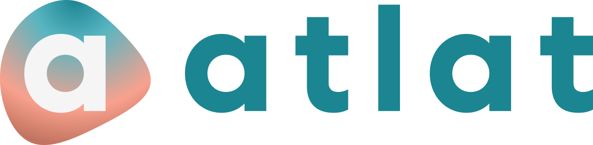

<!-- PROJECT SHIELDS -->
<!--
*** I'm using markdown "reference style" links for readability.
*** Reference links are enclosed in brackets [ ] instead of parentheses ( ).
*** See the bottom of this document for the declaration of the reference variables
*** for contributors-url, forks-url, etc. This is an optional, concise syntax you may use.
*** https://www.markdownguide.org/basic-syntax/#reference-style-links
-->
[![Contributors][contributors-shield]][contributors-url]
[![Forks][forks-shield]][forks-url]
[![Stargazers][stars-shield]][stars-url]
[![Issues][issues-shield]][issues-url]
[![LinkedIn][linkedin-shield]][linkedin-url]

<!-- PROJECT LOGO -->
 

  

  <h3 align="center">Check-In - Stats by atlat</h3>

  

    atlat's submission to the Worthy Web App Challenge by Progress
     
    <a href="https://github.com/annaira/atlat-checkin-stats">View Demo</a>
    ·
    <a href="https://github.com/annaira/atlat-checkin-stats/issues">Report Bug</a>
    ·
    <a href="https://github.com/annaira/atlat-checkin-stats/issues">Request Feature</a>
  

<!-- TABLE OF CONTENTS -->

  
Table of Contents

  <ol>
    <li>
      <a href="#about-the-project">About The Project</a>
      <ul>
        <li><a href="#built-with">Built With</a></li>
        <li><a href="#usage">Usage</a></li>
      </ul>
    </li>
    <li><a href="#run">Usage</a></li>
    <li><a href="#roadmap">Roadmap</a></li>
    <li><a href="#contributing">Contributing</a></li>
    <li><a href="#contact">Contact</a></li>
    <li><a href="#acknowledgements">Acknowledgements</a></li>
  </ol>

## About The Project

We are a social startup invested in improving working conditions for the workers who create the clothes we wear
 everyday. We participated in the [Worthy Web App Challenge](https://progress-worthyweb.devpost.com/) by Progress to create a way to measure the impact of a CSR
  project for worker rights in Pakistan and Vietnam we are currently developing. With Kendo, we easily created a survey
   as a chat and a dashboard to visualize the results and gather viable insights. You can try out the prototype here: [atlat-checkin-stats.herokuapp.com](https://atlat-checkin-stats.herokuapp.com/)

### Built With
* [Kendo React](https://www.telerik.com/kendo-react-ui/)
* [Create React App](https://github.com/facebook/create-react-app)

### Usage
We are using a tile layout by KendoReact, you can move the tiles around to create the dashboard you want.
[![Stats Overview][product-screenshot_1]](https://atlat-checkin-stats.herokuapp.com/)

The data can be filtered by gender or factory and some graphs even update to reflect the selection.
[![Factory Selection][product-screenshot_2]](https://atlat-checkin-stats.herokuapp.com/)

We included stats to highlight gender differences.
[![Stats Overview][product-screenshot_3]](https://atlat-checkin-stats.herokuapp.com/)

These stats aim to gather deep insights of the current worker safety situation.
[![Stats Overview][product-screenshot_4]](https://atlat-checkin-stats.herokuapp.com/)

## Run

To run this project locally run

### `npm start`

from the projet directory. This uns the app in the development mode.\
Open [http://localhost:3000](http://localhost:3000) to view it in the browser.

The page will reload if you make edits.\
You will also see any lint errors in the console.

## Roadmap

See the [open issues](https://github.com/annaira/atlat-checkin-stats/issues) for a list of proposed features (and known issues).

## Contributing

Contributions are what make the open source community such an amazing place to be learn, inspire, and create. Any contributions you make are **greatly appreciated**.

1. Fork the Project
2. Create your Feature Branch (`git checkout -b feature/AmazingFeature`)
3. Commit your Changes (`git commit -m 'Add some AmazingFeature'`)
4. Push to the Branch (`git push origin feature/AmazingFeature`)
5. Open a Pull Request

## Contact

Your Name - [@truecolorsscm](https://twitter.com/truecolorsscm) - team@truecolorssustainability.com

Project Link: [https://github.com/annaira/atlat-checkin-stats](https://github.com/annaira/atlat-checkin-stats)

## Acknowledgements
* [Kendo React](https://www.telerik.com/kendo-react-ui/)
* [Best ReadME templates](https://github.com/othneildrew/Best-README-Template/blob/master/README.md)
* [Create React App](https://github.com/facebook/create-react-app)

<!-- MARKDOWN LINKS & IMAGES -->
<!-- https://www.markdownguide.org/basic-syntax/#reference-style-links -->
[contributors-shield]: https://img.shields.io/github/contributors/annaira/atlat-checkin-stats.svg?style=for-the-badge
[contributors-url]: https://github.com/annaira/atlat-checkin-stats/graphs/contributors
[forks-shield]: https://img.shields.io/github/forks/annaira/atlat-checkin-stats.svg?style=for-the-badge
[forks-url]: https://github.com/annaira/atlat-checkin-stats/network/members
[stars-shield]: https://img.shields.io/github/stars/annaira/atlat-checkin-stats.svg?style=for-the-badge
[stars-url]: https://github.com/annaira/atlat-checkin-stats/stargazers
[issues-shield]: https://img.shields.io/github/issues/annaira/atlat-checkin-stats.svg?style=for-the-badge
[issues-url]: https://github.com/annaira/atlat-checkin-stats/issues
[linkedin-shield]: https://img.shields.io/badge/-LinkedIn-black.svg?style=for-the-badge&logo=linkedin&colorB=555
[linkedin-url]: https://www.linkedin.com/company/true-colors-company
[product-screenshot_1]: images/Dashboard_first_view.png
[product-screenshot_2]: images/Dashboard_factory_selection.png
[product-screenshot_3]: images/Dashboard_gender.png
[product-screenshot_4]: images/Dashboard_working_safety.png
[atlat-logo]: public/logo_full.png

